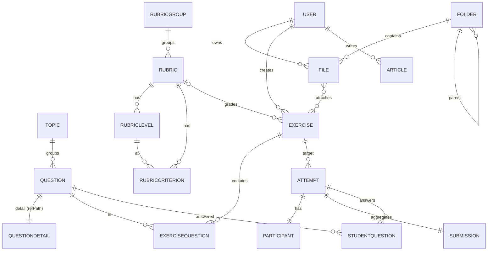

# Đặc tả thiết kế CSDL — Vườn Văn / Học Viện LMS

> Bản **thiết kế để duyệt** (chưa hiện thực hết). Quyết định đã chốt: tái sử dụng tối đa
> cấu trúc reference `edusoft-lms-api` → câu hỏi **tách bảng theo loại**, rubric **tách 4 bảng**,
> bài làm theo **mô hình thi đầy đủ** (attempt/participant/submission). **Bỏ classroom**;
> Kho học liệu **lưu link ngoài**.

## Nguyên tắc chung (tái dùng từ reference)
- `@Schema({ collection, timestamps:true, versionKey:false })`, quan hệ bằng `ObjectId + ref`, sở hữu bằng `userId`.
- Link ngoài: `@Prop({ match: /^(http|https):\/\/.+/ })`.
- Cây phân cấp: `parentId + ancestors[] + depth` + pre-hook (như `topic`, `item`).
- Đa hình (polymorphic): `xxxModel` (tên collection) + field `ObjectId` dùng `refPath: 'xxxModel'` (như `question.questionDetail`, `attempt.targetId`).
- Soft-delete/audit: `deletedAt`, `updatedBy`.

---

## Nhóm 1 — Tài khoản  ·  tái dùng `auth/user`
**Chỉ một bảng `users`** — bảo mật gọn nhẹ (JWT stateless, không 2FA/verify-email/refresh-token/bảng roles). Vai trò là enum; phân quyền theo `role`. **Không có theme cá nhân** — giao diện set ở cấp hệ thống (`settings.appearance`).
| Bảng | Field chính |
|------|-------------|
| **users** | name, email(unique, match), password(select:false), role(`student\|teacher\|admin`), avatar(url), status(`active\|inactive`), lastActiveAt |

## Nhóm 2 — Kho học liệu = **folders + files** (link ngoài)  ·  tái dùng `item` + `chapter-attachment`
Mô hình cây thư mục/tập tin: **folders** lồng nhau, **files** nằm trong folder (file = link ngoài).
| Bảng | Field chính |
|------|-------------|
| **folders** | name, parentId(→folders), ancestors[], depth, userId, isPublic *(cây thư mục: Giáo án, Phiếu học tập, Đề bài…)* |
| **files** | name, description, fileType(`pdf\|doc\|slide\|image\|audio\|video\|link\|other`), **source(`external\|internal`)**, **url(match http)**, fileKey(dự phòng host nội bộ), thumbnailUrl, folderId(→folders, null=gốc), size, sizeLabel, mimeType, subject, grade, tags[], userId, downloadCount, viewCount, isPublic |
| **downloads** *(màn "Của tôi" — tài liệu đã tải/đã lưu)* | userId, fileId, kind(`download\|save`), createdAt *(unique (userId,fileId,kind))* |

> **Cốt lõi**: mặc định `source=external` → file chỉ lưu `url` (Drive/YouTube/web…), **không cần hệ thống lưu trữ file**. `pre('validate')`: external→bắt buộc `url`; internal→bắt buộc `fileKey`.
> *(Class trong code: `Folder` (collection `folders`) + `FileItem` (collection `files`) — tránh trùng global `File` của Node.)*

## Nhóm 3 — Ngân hàng câu hỏi (chuẩn hóa, đa hình)  ·  tái dùng `topic` + `question` + chi tiết
| Bảng | Field chính |
|------|-------------|
| **topics** | parentId, ancestors[], depth, userId, title, description *(cây chủ đề)* |
| **questions** (base) | userId, topicId, title(search), content, type(`single\|multi\|truefalse\|fill\|essay\|match`), level(`easy\|medium\|hard`), tags[], **questionDetail(ObjectId, refPath:`questionModel`)**, questionModel, deletedAt, updatedBy |
| **single-choice-questions** | questionId, options[], attachments[]{optionIndex,name,url}, correctOptionIndex, allowShuffle |
| **multiple-choice-questions** | questionId, options[], attachments[], correctOptionIndices[], allowShuffle |
| **true-false-questions** | questionId, isCorrect(boolean) |
| **short-answer-questions** *(điền khuyết)* | questionId, answers[], matchMode(`exact\|...`) |
| **essay-questions** *(tự luận)* | questionId, gradingType, rubricId?, instructions[]{description,percent}, guideAnswer, isAutoGraded, allowUploadFiles, maxFileSize, maxFileCount |
| **match-questions** *(nối/kéo thả — bổ sung cùng pattern)* | questionId, pairs[]{left,right}, allowShuffle |
| **number-questions** *(đáp án số)* | questionId, answers[] |
| **sort-questions** *(sắp xếp thứ tự)* | questionId, options[], correctOrder[], allowShuffle |
| **table-selection-questions** *(chọn Đúng/Sai theo bảng)* | questionId, statements[], correctAnswers, allowShuffle |

> Mỗi câu hỏi = 1 dòng `questions` (metadata chung) + 1 dòng ở bảng chi tiết tương ứng (trỏ qua `questionDetail/questionModel`).

## Nhóm 4 — Rubric (chuẩn hóa 4 bảng)  ·  tái dùng `rubric*`
| Bảng | Field chính |
|------|-------------|
| **rubric-groups** | userId, name |
| **rubrics** | userId, groupId, name, code, description, isChecklist, useGrades |
| **rubric-levels** | rubricId, name, percentage *(Xuất sắc 100% · Tốt 80%…)* |
| **rubric-criterions** | rubricId, levelId, name, note, weight(0–100), items[] |

## Nhóm 5 — Bài tập & Bài làm (mô hình thi đầy đủ, không lớp)  ·  tái dùng `exercise*` + `attempt/participant/submission/student-question`
| Bảng | Field chính |
|------|-------------|
| **exercises** | userId(người tạo), title, description, type(`quiz\|essay\|file`), subject, grade, status, dueDate, points, durationMinutes, maxAttempts, shuffle, showAnswer, materialIds[] *(không có rubricId — rubric gắn theo `essay-questions`)* |
| **exercise-questions** | exerciseId, questionId, order, grades *(điểm/câu; unique (exerciseId,questionId))* |
| **attempts** | targetModel(`Exercise`)+targetId(refPath), studentId?/sessionId?, attemptNumber, isSelected, submittedAt, anonymousExpiresAt |
| **participants** | studentId?/sessionId?, attemptId(unique), joinedAt, startedAt, endedAt, isFinished, isBanned |
| **submissions** *(tổng hợp/lượt làm)* | attemptId, correct, wrong, notComplete, waitingGrades, numberOfEssays, multipleChoiceGrades, essayGrades, totalGrades(virtual), submittedAt |
| **student-questions** *(đáp án từng câu)* | attemptId, questionId, studentId?/sessionId?, answer(Mixed), isCorrect, grades, shuffledOptionIndices[] |
| **self-assessments** *(màn "Tự đánh giá" — học viên dùng rubric tự chấm bài mình)* | userId, rubricId, source(`file\|exercise\|text`), fileId?/exerciseId?/text, scores[]{criterionId,levelId,percent}, totalPercent, note |

> Hỗ trợ cả người dùng đăng nhập (`studentId`) lẫn khách ẩn danh (`sessionId`) — đúng như reference (Kho học liệu "truy cập tự do").

## Nhóm 6 — Nội dung  ·  tái dùng `article`
| Bảng | Field chính |
|------|-------------|
| **articles** | userId, title, slug, excerpt, content, images[], category, cover, tags[], isPublished, isFeatured, viewCount, readMinutes |

> *(Tùy chọn — nếu bật tương tác blog)* `article-comments` (articleId, userId, content, parentId) · `article-likes` (articleId, userId). Frontend hiện chỉ đọc → tạm chưa thêm.

## Nhóm 7 — Hệ thống & cấu hình
| Bảng | Field chính |
|------|-------------|
| **settings** *(màn "Cài đặt hệ thống" — 1 document singleton key=`system`)* | org{name,domain,logoUrl,timezone}, appearance{accent,headingFont,dark,density,railWide,assignFlow,rubricStyle}, misc{allowGoogleLogin…} |

> Tổng quan / Báo cáo & Thống kê **tính trực tiếp** bằng aggregation từ các bảng — không cần bảng riêng.

---

## ERD (rút gọn)

## Tổng cộng **28 bảng** (7 nhóm)
users · folders · files · downloads · topics · questions · single/multiple/true-false/short-answer/essay/match/number/sort/table-selection-questions *(9 dạng)* · rubric-groups/rubrics/rubric-levels/rubric-criterions · exercises · exercise-questions · attempts · participants · submissions · student-questions · self-assessments · articles · settings

## Việc sẽ làm khi hiện thực (thay phần đã code tạm)
- Giữ & đổi tên: `material-folders`→`folders`, `materials`→`files` (giữ thiết kế link ngoài); giữ `users`, `articles`, `notifications`.
- Thay: `questions` (nhúng → base + 6 chi tiết), `rubrics` (nhúng → 4 bảng), `assignments`+`submissions` (→ exercises + exercise-questions + attempts + participants + submissions + student-questions).
- Thêm: `topics`, các bảng chi tiết câu hỏi, rubric-levels/criterions/groups, exam-engine.
- Cập nhật enums + `database.module.ts` + `DATABASE.md`.
