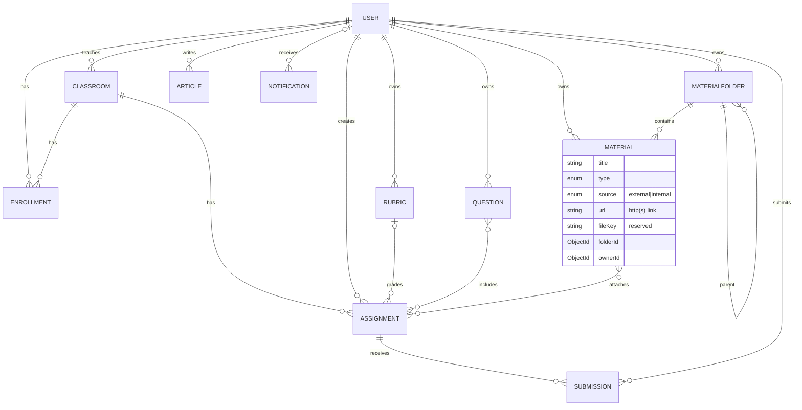

# Cơ sở dữ liệu — Vườn Văn / Học Viện LMS

- **Engine:** MongoDB, truy cập qua **Mongoose** + `@nestjs/mongoose` (đúng quy ước của `edusoft-lms-api/src/schemas`: `@Schema`/`@Prop`/`SchemaFactory`, `timestamps: true`, `versionKey: false`, quan hệ bằng `ObjectId` + `ref`).
- **Vị trí schema:** [`src/schemas/`](../src/schemas) — mỗi collection một file `*.schema.ts`.
- **Đăng ký model:** [`src/database/database.module.ts`](../src/database/database.module.ts) (global) → mọi module inject được model bằng `@InjectModel(Material.name)`.
- **Kết nối:** [`src/app.module.ts`](../src/app.module.ts) đọc `MONGODB_URI` từ `.env` (mặc định `mongodb://127.0.0.1:27017/lms`).

## Trọng tâm: Kho học liệu lưu **link ngoài** (không cần tự lưu trữ file)

`Material` được thiết kế **external-link-first**:

| Field | Ý nghĩa |
|-------|---------|
| `source` | `external` (mặc định) \| `internal`. **External** = chỉ là một đường dẫn tới tài nguyên nơi khác. |
| `url` | Link http(s) tới tài liệu (Google Drive, YouTube, website, PDF…). Bắt buộc khi `source = external`. Có validate `match: /^https?:\/\/.+/`. |
| `fileKey` | Khóa object-storage — **dành cho sau này** nếu muốn tự host file (`source = internal`). Hiện không dùng. |
| `type` | `pdf \| doc \| slide \| image \| audio \| video \| link \| other` (để chọn icon + lọc). |

Một `pre('validate')` hook đảm bảo: external → phải có `url`; internal → phải có `fileKey`. Nhờ vậy **không cần xây dựng hệ thống lưu trữ tài liệu** — chỉ lưu link. Khi nào cần host file thật thì bật `source = internal` mà không phải đổi schema.

Tài liệu được sắp xếp theo cây thư mục `MaterialFolder` (materialized-path: `parentId` + `ancestors[]` + `depth`) cho các nhóm như *Giáo án, Phiếu học tập, Đề bài, Sơ đồ tư duy…*; ngoài ra còn `category`, `subject`, `grade`, `tags[]` để lọc/tìm (`materials` có text index trên `title/tags/category`).

## Các collection

| Collection | Mô tả | Quan hệ chính |
|-----------|-------|---------------|
| `users` | Tài khoản (student/teacher/admin) | — |
| `classrooms` | Lớp học | `teacherId → User` |
| `enrollments` | Thành viên lớp (n–n User↔Classroom) | `userId → User`, `classroomId → Classroom` (unique cặp) |
| `material-folders` | Thư mục Kho học liệu (cây) | `parentId → MaterialFolder`, `ownerId → User` |
| `materials` | **Kho học liệu (link ngoài)** | `folderId → MaterialFolder`, `ownerId → User` |
| `questions` | Ngân hàng câu hỏi | `ownerId → User` |
| `rubrics` | Rubric (nhúng `criteria[]` + `scale[]`) | `ownerId → User` |
| `assignments` | Bài tập / giao bài | `classroomId`, `ownerId`, `rubricId?`, `questionIds[]`, `materialIds[]` |
| `submissions` | Bài nộp / chấm bài | `assignmentId`, `studentId`, `gradedById?` (unique cặp assignment+student) |
| `articles` | Bài viết / blog | `authorId → User` |
| `notifications` | Thông báo / nhật ký | `userId?` (null = broadcast) |

## ERD



## Quy ước & chỉ mục
- `timestamps: true` → mọi document có `createdAt`/`updatedAt`. `versionKey: false`.
- Quan hệ bằng `ObjectId` + `ref` (chuẩn hóa), trừ `Rubric.criteria`/`scale` được **nhúng** (đơn giản; bản tham khảo tách thành `rubric-criterion`/`rubric-level`).
- Index: khóa ngoại đều `index: true`; cặp duy nhất `enrollments(userId,classroomId)`, `submissions(assignmentId,studentId)`; text index trên `materials`.
- Bộ đếm denormalized (`Classroom.studentCount`, `Assignment.submittedCount/gradedCount`, `Material.downloadCount`…) do service layer giữ đồng bộ.

## Chạy
```bash
cd backend
cp .env.example .env          # chỉnh MONGODB_URI nếu cần
# cần một MongoDB đang chạy (local hoặc Atlas)
pnpm start:dev                # API khởi động + kết nối Mongo, tự tạo collection/index
```
> Chưa có MongoDB? Dùng Docker nhanh: `docker run -d -p 27017:27017 --name lms-mongo mongo:7`
```
